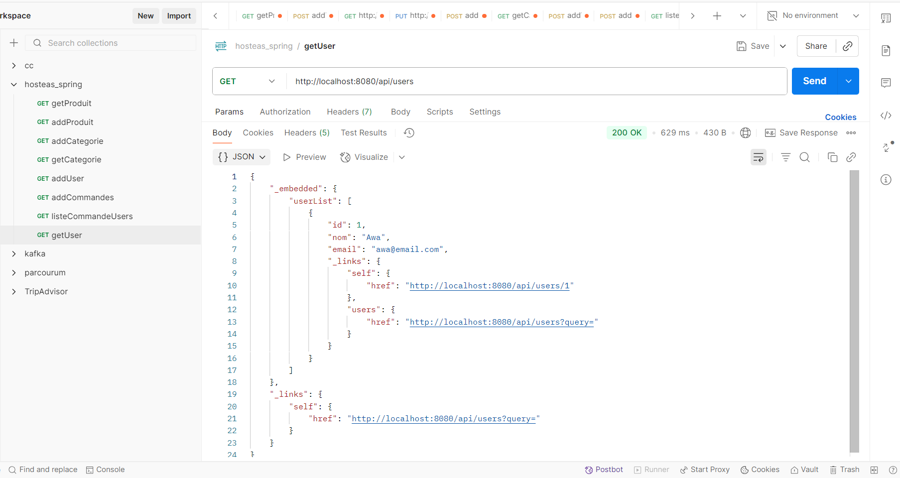

# REQUIREMENTS
Prérequis pour démarrer le projet :

  Java 23
  
  Maven
  
  Postman


## Clone du projet
  :rocket:
  
  ```bash
  git clone https://github.com/ThiamAwa/eshop-microservices.git
  cd eshop-microservices
  # Lancer l'application
  mvn spring-boot:run
  ```
## Objectifs
--- 
```
Ce projet a pour but de se familiariser avec le développement d’une application **Spring Boot** en architecture **microservices**, et de comprendre comment exposer et gérer des entités via une **API RESTful Level 3 (HATEOAS)**.  
Il permet également d’apprendre à documenter une API avec **Swagger-UI** et **Redoc**.

Ce projet permet de comprendre :
- Comment fonctionne une application Spring Boot avec microservices ?
- Comment mettre en place une architecture REST Level 3 (HATEOAS) ?
- Comment gérer les entités Produit, Categorie, User et Commande via une API REST ?
- Comment documenter une API avec Swagger-UI et Redoc ?
 ```

## Architecture
- **Spring Boot** + **Spring Data JPA**
- **Postgres** pour la base de données
- **Spring HATEOAS** pour les liens REST Level 3
- **Swagger-UI** et **Redoc** pour la documentation
- **Postman** pour les tests API

---

## Entités et Repositories
Chaque entité a un repository pour accéder à la base de données :
- `ProduitRepository`
- `CategorieRepository`
- `UserRepository`
- `CommandeRepository`

Les repositories manipulent uniquement les **Entities**.

---

## Endpoints principaux

### Produit
- GET `/api/produits` → liste tous les produits
- GET `/api/produits/{id}` → produit par id
- POST `/api/produits` → créer produit
- PUT `/api/produits/{id}` → modifier produit
- DELETE `/api/produits/{id}` → supprimer produit

### Commande
- GET `/api/commandes` → liste toutes les commandes
- GET `/api/commandes/{id}` → commande par id
- POST `/api/commandes` → créer commande
- PUT `/api/commandes/{id}` → modifier commande
- DELETE `/api/commandes/{id}` → supprimer commande
- GET `/api/commandes/user/{userId}` → commandes d’un utilisateur
- GET `/api/commandes/produit/{produitId}` → commandes contenant un produit

---

## Documentation API
- Swagger UI : `http://localhost:8080/swagger-ui.html`
  
  
  
  
- Redoc : `http://localhost:8080/redoc.html`
  
  
- Postman : importer la collection `Eshop.postman_collection.json` fournie
  ### GET /users
  
  ### POST /users
  
  ### DELETE /users/{id}
  
  ### PUT /users/{id}
  
  
### GET /produits


### GET /produits/{id}


### POST /produits


### PUT /produits/{id}


### DELETE /produits/{id}


---

### GET /categories


### POST /categories


---

### GET /commandes


### POST /commandes


---

---

## Instructions pour tester
1. Cloner le projet
2. Configurer la base de données (postgres)
3. Lancer l’application
4. Tester les endpoints via :
   - Swagger UI
   - Redoc
   - Postman 

---

## Technologies utilisées
- Java 23
- Spring Boot
- Spring Data JPA
- PostgreSQL 16
- Maven 3.9.9
- Spring HATEOAS
- Swagger-UI & Redoc
- Postman
---
## Contact
- Nom : Awa Thiam
- GitHub : [https://github.com/ThiamAwa](https://github.com/ThiamAwa)
- Email : thiamawa@groupeisi.com


